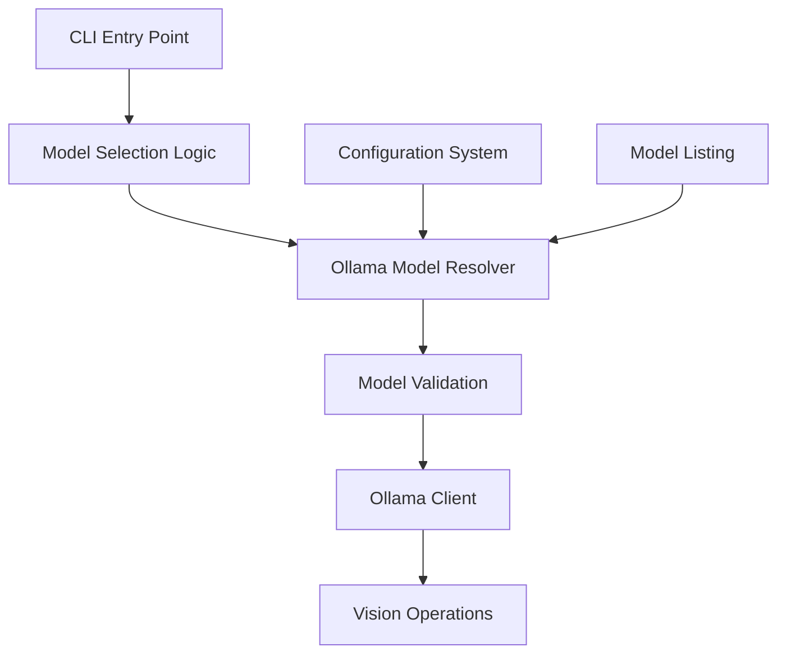

# Design Document

## Overview

This design enhances the self-operating-computer framework to support flexible Ollama model selection. Currently, the system is hardcoded to use the "llava" model when running in Ollama mode. This enhancement will allow users to specify any locally available Ollama model (like llava:7b, llama2, codellama, etc.) while maintaining backward compatibility.

The solution introduces a new command-line parameter for specifying Ollama models, adds model validation and listing capabilities, and implements a configuration system for setting default models.

## Architecture

The enhancement follows the existing architecture pattern with minimal changes:



### Key Components

1. **Ollama Model Resolver**: New component that handles model name resolution and validation
2. **Enhanced CLI Parser**: Extended to support Ollama-specific model parameters
3. **Configuration Manager**: Enhanced to store and retrieve default Ollama model preferences
4. **Model Validator**: New component that verifies model availability before operations

## Components and Interfaces

### Enhanced CLI Interface

```python
# New command patterns:
operate -m ollama:llava:7b          # Specify exact model
operate -m ollama --list-models     # List available models
operate -m ollama --set-default llava:7b  # Set default model
operate -m llava                    # Backward compatibility (unchanged)
```

### Ollama Model Resolver

```python
class OllamaModelResolver:
    def resolve_model(self, model_spec: str) -> str:
        """
        Resolve model specification to actual model name.
        
        Args:
            model_spec: Can be "llava", "ollama:llava:7b", or "ollama"
            
        Returns:
            Actual model name to use with Ollama client
        """
        
    def list_available_models(self) -> List[ModelInfo]:
        """List all locally available Ollama models."""
        
    def validate_model(self, model_name: str) -> bool:
        """Validate that a model exists and is accessible."""
```

### Enhanced Configuration System

```python
class Config:
    def get_default_ollama_model(self) -> Optional[str]:
        """Get the configured default Ollama model."""
        
    def set_default_ollama_model(self, model_name: str) -> None:
        """Set the default Ollama model."""
        
    def initialize_ollama_with_model(self, model_name: str) -> Client:
        """Initialize Ollama client with specific model validation."""
```

### Model Information Structure

```python
@dataclass
class ModelInfo:
    name: str
    size: str
    modified: datetime
    family: str
    format: str
```

## Data Models

### Model Specification Format

The system will support multiple model specification formats:

1. **Legacy Format**: `llava` (backward compatibility)
2. **Explicit Format**: `ollama:model_name` (e.g., `ollama:llava:7b`)
3. **Auto-resolve Format**: `ollama` (uses configured default or "llava")

### Configuration Storage

Default model preferences will be stored in the existing `.env` file:

```
OLLAMA_DEFAULT_MODEL=llava:7b
OLLAMA_HOST=http://localhost:11434
```

## Error Handling

### Model Not Found
- **Detection**: When specified model doesn't exist locally
- **Response**: List available models and suggest alternatives
- **Recovery**: Fall back to default model if available

### Ollama Service Unavailable
- **Detection**: Connection refused or timeout to Ollama service
- **Response**: Provide clear instructions to start Ollama service
- **Recovery**: No automatic recovery, user must start service

### Invalid Model Format
- **Detection**: Malformed model specification
- **Response**: Show correct format examples
- **Recovery**: Prompt for correct model specification

### No Models Available
- **Detection**: Ollama running but no models installed
- **Response**: Provide installation instructions for popular models
- **Recovery**: Exit gracefully with helpful message

## Testing Strategy

### Unit Tests
- Model specification parsing and validation
- Configuration management (get/set default models)
- Error handling for various failure scenarios
- Backward compatibility with existing model selection

### Property-Based Tests
- Model name validation across various input formats
- Configuration persistence and retrieval
- Error message consistency and helpfulness

**Testing Framework**: pytest with property-based testing using Hypothesis

**Test Configuration**: Minimum 100 iterations per property test

## Correctness Properties

*A property is a characteristic or behavior that should hold true across all valid executions of a system-essentially, a formal statement about what the system should do. Properties serve as the bridge between human-readable specifications and machine-verifiable correctness guarantees.*

### Property 1: Model Specification Acceptance
*For any* valid Ollama model identifier format, the system should accept the specification without error and parse it correctly
**Validates: Requirements 1.1**

### Property 2: Exact Model Usage
*For any* specified Ollama model name, when passed to the Ollama client, that exact model name should be used in the chat operation
**Validates: Requirements 1.2**

### Property 3: Error Message Generation
*For any* invalid model identifier, the system should return a descriptive error message that helps the user understand the correct format
**Validates: Requirements 1.4**

### Property 4: Model Listing Completeness
*For any* set of available Ollama models, the listing function should return all models with complete information (name, size, modified date)
**Validates: Requirements 2.1, 2.2**

### Property 5: Configuration Persistence
*For any* valid model name set as default, the configuration system should persist and retrieve that exact model name
**Validates: Requirements 3.1**

### Property 6: Default Model Usage
*For any* configured default model, when no explicit model is specified, the system should use that configured default
**Validates: Requirements 3.2**

### Property 7: Command-Line Override
*For any* combination of configured default and command-line specified model, the command-line model should take precedence
**Validates: Requirements 3.4**

### Property 8: Model Validation and Operation
*For any* valid model that exists locally, validation should succeed and normal operations should proceed
**Validates: Requirements 4.1, 4.4**

### Property 9: Alternative Suggestions
*For any* non-existent model name, the error response should include suggestions from available models
**Validates: Requirements 4.2**

### Property 10: Configuration Compatibility
*For any* existing configuration file format, the enhanced system should read and honor the configuration without modification
**Validates: Requirements 5.2**

### Property 11: Default Fallback Behavior
*For any* system state where no model is specified and no default is configured, the system should fall back to "llava" behavior
**Validates: Requirements 1.3, 3.3, 5.3**

### Example Test Cases

**Backward Compatibility Test**: The existing `-m llava` command should function exactly as before
**Validates: Requirements 5.1**

**No Models Available**: When Ollama has no models installed, provide installation guidance
**Validates: Requirements 2.3**

**Service Unavailable**: When Ollama service is not running, provide startup instructions
**Validates: Requirements 2.4, 4.3**

## Testing Strategy

### Dual Testing Approach

The testing strategy employs both unit tests and property-based tests to ensure comprehensive coverage:

**Unit Tests** focus on:
- Specific examples demonstrating correct behavior
- Edge cases like empty model lists or service unavailability
- Integration points between CLI, configuration, and Ollama client
- Backward compatibility scenarios

**Property-Based Tests** focus on:
- Universal properties that hold across all valid inputs
- Model name parsing and validation across various formats
- Configuration persistence and retrieval with random model names
- Error handling consistency across different invalid inputs

### Property-Based Testing Configuration

**Framework**: pytest with Hypothesis for property-based testing
**Minimum Iterations**: 100 per property test
**Test Tags**: Each property test must reference its design document property using the format:
- **Feature: ollama-model-flexibility, Property 1: Model Specification Acceptance**
- **Feature: ollama-model-flexibility, Property 2: Exact Model Usage**
- And so on for each property

### Test Coverage Requirements

- All acceptance criteria must be covered by either unit tests or property tests
- Property tests validate universal behaviors across input ranges
- Unit tests validate specific examples and integration scenarios
- Both test types are complementary and necessary for complete validation