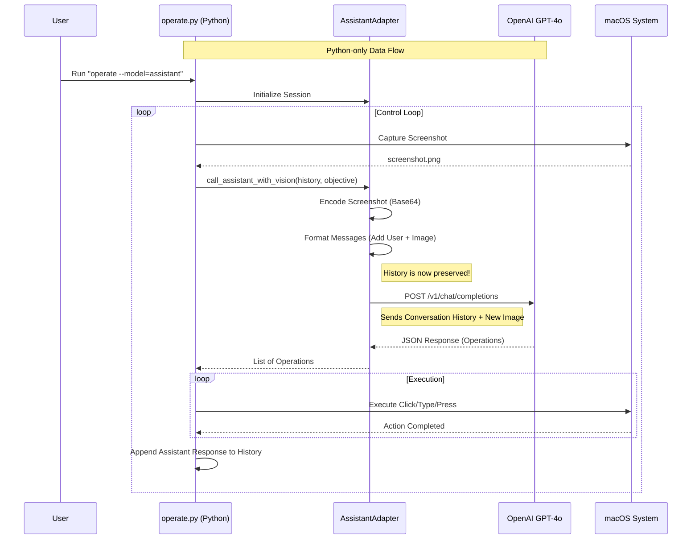

# Self-Operating Computer + Assistant Integration

🤖 **AI-Powered Computer Control on macOS**

This project uses **[self-operating-computer](https://github.com/OthersideAI/self-operating-computer)** to enable AI-driven computer automation using GPT-4 Vision directly.

## ✨ Features

### 🎯 Core Capabilities

#### **Visual Intelligence**
- 👁️ **Screen Understanding** - GPT-4 Vision analyzes your desktop in real-time
- 🔍 **Element Recognition** - Identifies buttons, text fields, menus, and UI components
- 📊 **Context Awareness** - Understands what's on screen and what actions are available

#### **Autonomous Control**
- 🖱️ **Precise Mouse Control** - Pixel-perfect clicking, dragging, and navigation
- ⌨️ **Keyboard Automation** - Types text and executes keyboard shortcuts (Cmd+C, Cmd+Tab, etc.)
- 🎮 **Multi-Step Workflows** - Chains actions together to complete complex tasks

#### **Task Execution**
- 🌐 **Web Automation** - Opens browsers, navigates websites, fills forms
- 📁 **File Management** - Creates folders, moves files, organizes documents
- 💻 **Application Control** - Launches apps, switches windows, manages workflows
- 🔧 **Development Tasks** - Opens IDEs, runs terminal commands, manages git repos

### 🆕 Enhanced Features

#### **🛡️ Safety & Security**
- ⚠️ **Dangerous Command Blocking** - Automatically prevents destructive operations:
  - `rm -rf` (recursive file deletion)
  - `mkfs` (disk formatting)
  - `dd` (direct disk writes)
  - Fork bombs and system-critical commands
- 🚨 **Real-time Warnings** - Visual alerts when blocking dangerous actions
- 🔒 **Validation Layer** - Pre-execution safety checks on all operations

#### **🔄 Reliability & Performance**
- ♻️ **Smart Retry Logic** - Auto-retries failed API calls (up to 3 attempts)
- ⏱️ **Exponential Backoff** - Intelligent waiting between retries (4s → 8s → 16s)
- 🌐 **Network Resilience** - Handles temporary connection issues gracefully
- 💪 **Error Recovery** - Continues operation even if individual steps fail

#### **💰 Cost Optimization**
- 📉 **Image Compression** - Automatic screenshot optimization:
  - Resizes to max 1920x1080 (HD quality)
  - Converts to JPEG (85% quality)
  - **70-80% reduction** in token usage
- ⚡ **Faster Response Times** - Smaller images = quicker API calls
- 💵 **Lower API Costs** - Significant savings on OpenAI usage

#### **🧠 Memory & Context**
- 📝 **Conversation History** - Remembers all previous actions in the session
- 🔗 **Contextual Understanding** - References past steps when planning next actions
- 🎯 **Goal Tracking** - Maintains focus on the original objective across multiple steps
- 🔄 **Learning from Mistakes** - Can adjust approach based on previous failures

### ⚡ Architecture Benefits

- 🐍 **Pure Python** - No Node.js dependency, simpler setup
- 🚀 **Direct API Integration** - Faster communication with OpenAI
- 🔧 **Easy to Debug** - Single-language codebase
- 📦 **Lightweight** - Minimal dependencies, quick installation

## 🎬 Quick Start

### 1. Install & Configure (5 minutes)

```bash
# Install Python dependencies
cd self-operating-computer
pip install -r requirements.txt

# Configure OpenAI API key
cp config.example .env
nano .env  # Add your OPENAI_API_KEY
```

### 2. Grant macOS Permissions

Go to **System Settings** → **Privacy & Security** and add **Terminal** to:
- Screen Recording
- Accessibility

### 3. Run Your First Command

```bash
# From self-operating-computer directory
operate --model=assistant --prompt="open Safari"
```

## 🏗️ How It Works (Visual Workflow)

This system connects directly to OpenAI to understand your screen and control your computer.



## 📦 Project Structure

```
hackparv/
├── self-operating-computer/      # Python computer control framework
│   ├── operate/
│   │   ├── main.py              # Entry point
│   │   ├── operate.py           # Main orchestration
│   │   ├── config.py            # Configuration
│   │   └── models/
│   │       ├── apis.py          # Model integrations
│   │       └── assistant_adapter.py  # ✨ UPDATED: Direct OpenAI integration
│   └── requirements.txt
│
├── README.md                    # This file (Updated)
├── QUICKSTART.md
└── USAGE_GUIDE.md
```

## 🎮 Command-Line Options

```bash
operate --model=assistant [OPTIONS]

Options:
  -m, --model MODEL       AI model to use (assistant, gpt-4-with-ocr, claude-3, etc.)
  --prompt PROMPT         Direct command (skips interactive prompt)
  --verbose               Show detailed logs
```

## 🔒 Security

- ✅ API keys stored in `.env` (gitignored)
- ✅ Local-first: Screenshots are processed in memory and sent directly to OpenAI
- ✅ Minimal permissions: Only Screen Recording + Accessibility
- ✅ Transparent: Verbose mode shows all actions

## 📧 Support

1. Run `operate --model=assistant --verbose` for detailed logs.
2. Check `self-operating-computer` documentation for framework-specific issues.


